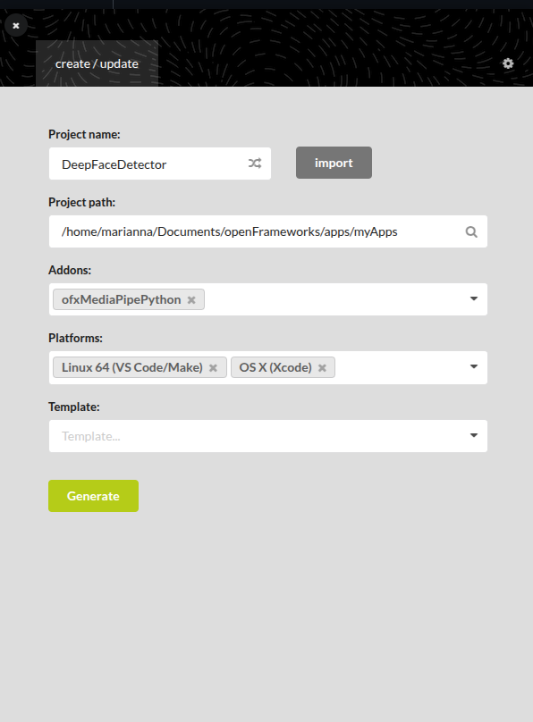
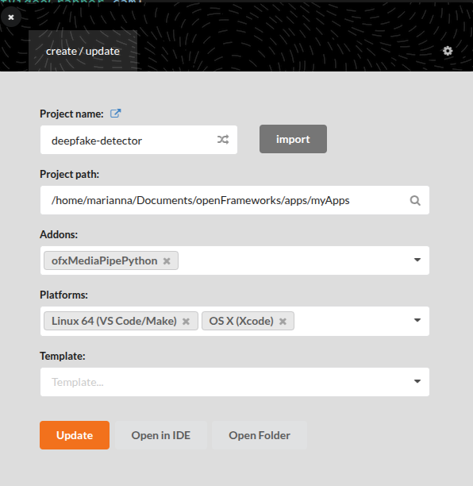

# Fresh Ubuntu installation of OpenFrameworks

1. Download openFrameworks from https://openframeworks.cc/download/
2. Open a terminal and cd to openFrameworks location
3. Unzip and rename the folder

```bash
    tar -zxvf of_v0.12.0_linux64gcc6_release.tar.gz
    mv of_v0.12.0_linux64gcc6_release openFrameworks
```

4. Install OF dependencies:

```bash
cd openFrameworks/scripts/linux/ubuntu
sudo ./install_dependencies.sh
```

5. Compile OF and Project Generator:
```bash
cd ..
./compileOF.sh -j4
./compilePG.sh
```

To test an example:

```bash
cd ~/openFrameworks/examples/graphics/polygonExample
make
make run
```

# Setting up ofxMediaPipe

### 1. Download ofxMediaPipe:

```bash
cd <path of openFrameworks directory>/openFrameworks/addons
git clone https://github.com/design-io/ofxMediaPipePython.git
```

### 2. Install ofxMediaPipe:
```bash
cd ofxMediaPipePython
./InstallMediaPipe.sh
```

### 3. Download required models
```bash
mkdir -p <of path>/openFrameworks/addons/ofxMediaPipe/libs/mediapipe/models
cd <of path>/openFrameworks/addons/ofxMediaPipe/libs/mediapipe/models
wget https://storage.googleapis.com/mediapipe-models/face_landmarker/face_landmarker/float16/1/face_landmarker.task
```

### 4. Install python 3.11 and prerequisites
```bash
sudo apt install python3-pip python3.11-venv python3.11-full libpython3.11-stdlib -y
python3.11 -m pip install mediapipe numpy --user
```

### 5. Export path to addon and to venv: 
```bash
export LD_LIBRARY_PATH=~/openFrameworks/addons/ofxMediaPipe/libs/mediapipe/lib/linux:$LD_LIBRARY_PATH
export LD_LIBRARY_PATH=/home/marianna/anaconda3/envs/mediapipe/lib:$LD_LIBRARY_PATH
```

### 6. Activate venv and install python packages:
```bash
conda activate mediapipe
pip install Pillow matplotlib
```

# Set up project

### New project

Using the project generator:

```bash
cd <of path>/openFrameworks/projectGenerator
./projectGenerator
```

Import the existing project, add the oxfMediaPipePython addon, configure your platform, and update.




### Existing project

```bash
git clone https://github.com/Mista-Kev/deepfake-detector.git
cd <of path>/openFrameworks/projectGenerator
./projectGenerator
```

Create a new project, add the oxfMediaPipePython addon, configure your platform, and generate.



# Execution

```bash
cd <of path>/openFrameworks/apps/myApps/deepfake-detector
make -j4
make runRelease
```